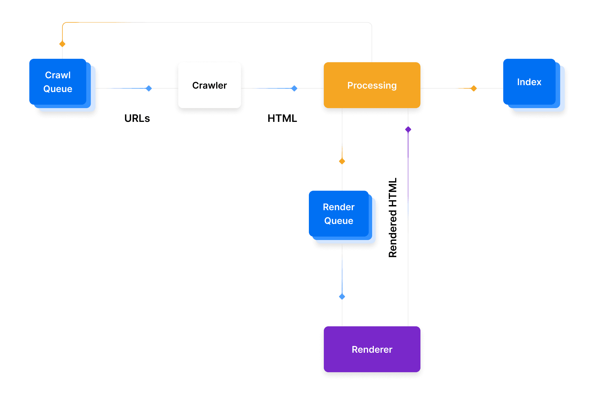

# What are Web Crawlers?

In order for your website to appear in search results, Google (as well as other search engines such as Bing, Yandex, Baidu, Naver, Yahoo or DuckDuckGo) use web crawlers to navigate the website to discover websites and its web pages.

Different search engines have different market shares in each country.

In this guide we cover Google, which is the biggest search engine in most countries. That being said, you might want to check other search engines and their guidelines, especially if your target customers are in China, Russia, Japan or South Korea.

While there are some differences when it comes to Ranking and Rendering, most search engines work in a very similar way when it comes to Crawling and Indexing.

Web crawlers are a type of bot that emulate users and navigate through links found on the websites to index the pages. Web crawlers identify themselves using custom user-agents. Google has several web crawlers, but the ones that are used more often are Googlebot Desktop and Googlebot Smartphone.

#### How Does Googlebot Work?

A general overview of the process can be the following:

- Find URLs: Google sources URLs from many places, including Google Search Console, links between websites, or XML sitemaps.
- Add to Crawl Queue: These URLs are added to the Crawl Queue for the Googlebot to process. URLs in the Crawl Queue usually last seconds there, but it can be up to a few days depending on the case, especially if the pages need to be rendered, indexed, or – if the URL is already indexed – refreshed. The pages will then enter the Render Queue.
- HTTP Request: The crawler makes an HTTP request to get the headers and acts according to the returned status code:
200: It crawls and parses the HTML.
30X: It follows the redirects.
40X: It notes the error and does not load the HTML.
50X: It may come back later to check if the status code has changed.
- Render Queue: The different services and components of the search system process the HTML and parse the content. If the page has some JavaScript client-side based content, the URLs might be added to a Render Queue. Render Queue is more costly for Google as it needs to use more resources to render JavaScript and therefore URLs rendered are a smaller percentage over the total pages out there on the internet. Some other search engines might not have the same rendering capacity as Google, and this is where Next.js can help with your rendering strategy.
- Ready to be indexed: If all criteria are met, the pages may be eligible to be indexed and shown in search results.

In the next few sections, we will take a deep dive into each of the main components of a search system's processes: crawling and indexing, and rendering and ranking.

#### Further Reading

- Google: SEO Starter Guide
- MDN: MDN: User-Agents
