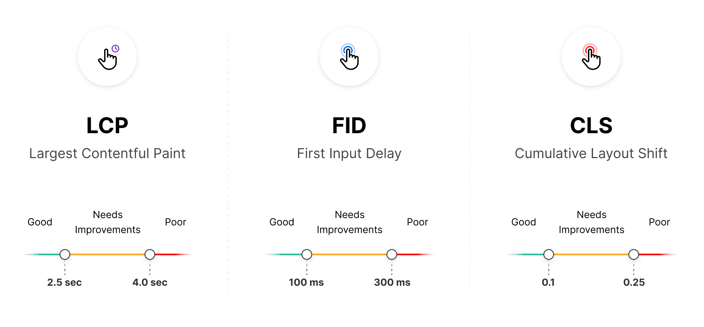

# Web Vitals Overview

17

Chapter 17

In this lesson, we will go through the different metrics, the impact that Core Web Vitals can have on your SEO,
and the importance they have over your user experience.

There are three different values when measuring Core Web Vitals:

"Good", "Needs Improvement", and "Poor". These values differ based on the vital being measured:

You can approach Core Web Vitals in two different ways:

- Try to achieve the highest score possible on each metric. Striving for perfection is great, but it might be tricky on large websites with many dependencies.
- Benchmark against competitors in your industry. You are not competing with every perfectly optimized website in Google search, but with others ranking for your target keywords.

#### Next Steps

In the following lessons, we will go through each vital to understand what it
measures.

### You've Completed Chapter 17

Next Up

18: Largest Contentful Paint (LCP)

Was this helpful?