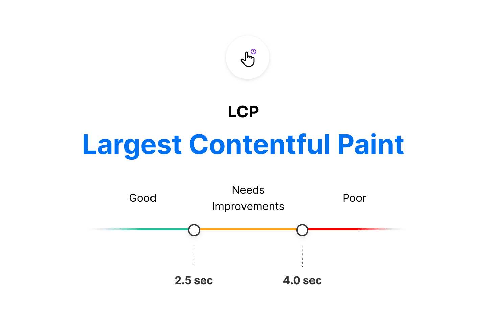

# Largest Contentful Paint (LCP)

18

Chapter 18

The Largest Contentful Paint (LCP) metric looks at the loading performance of your page. LCP measures the time it takes to get the largest element on the page visible within the viewport. This could be a large text block, video, or image that takes up the primary real estate on the page.

Note: This is not First Contentful Paint (FCP), which measures the time from when the page begins to load to when the first element
is rendered on screen.

As the DOM is rendered, the largest element on the page may change. The Largest Contentful Paint doesn't stop counting until the largest image orelement is seen on-screen.

#### Further Reading

- Google: Largest Contentful Paint Documentation
- Vercel: Blog: Core Web Vitals - Largest Contentful Paint

### You've Completed Chapter 18

Next Up

19: First Input Delay (FID)

Was this helpful?