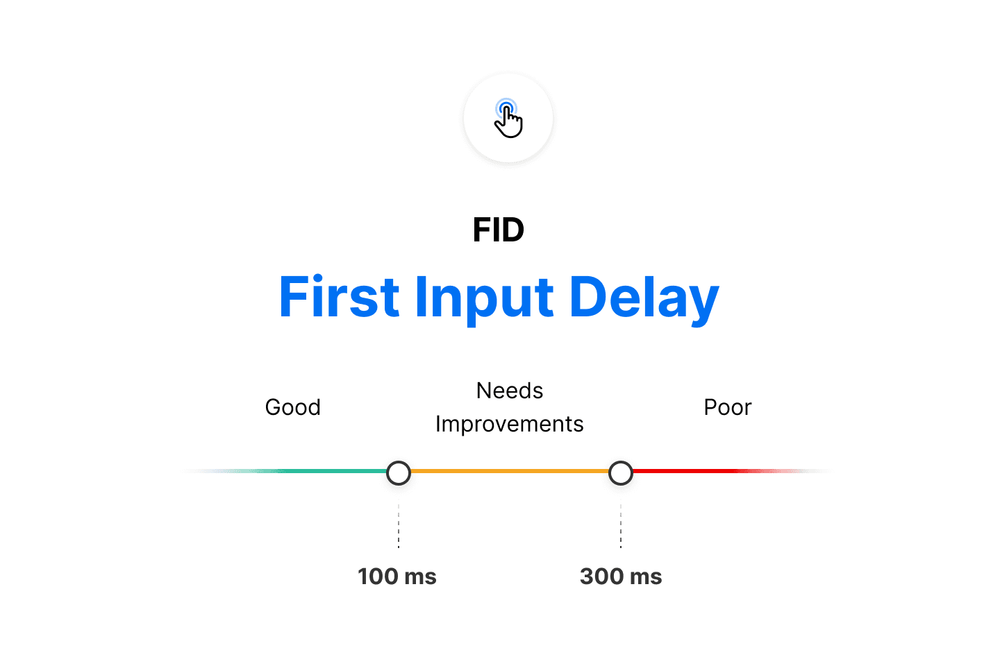

# First Input Delay (FID)

19

Chapter 19

The First Input Delay (FID) metric is the perception of an
end user’s experience while interacting with a web page. Imagine clicking
inside an input box only for nothing to happen – this frustration with the
interactivity and responsiveness of a site is caused by large input delays.

FID requires real user data and cannot be measured in the lab (e.g. Google Lighthouse). However, the Total Blocking Time (TBT) metric is lab-measurable and captures issues that affect interactivity.

#### Further Reading

- Google: First Input Delay Documentation
- Vercel: Blog: Core Web Vitals - First Input Delay
