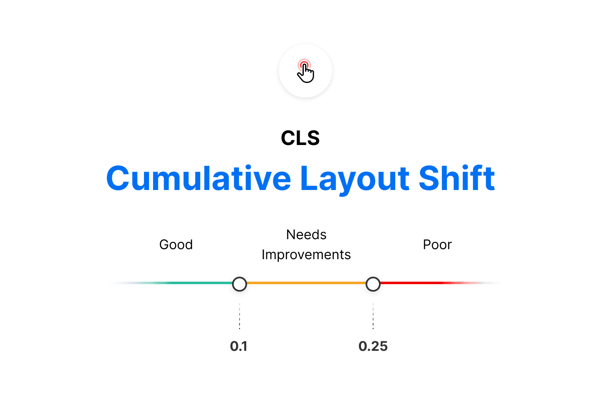
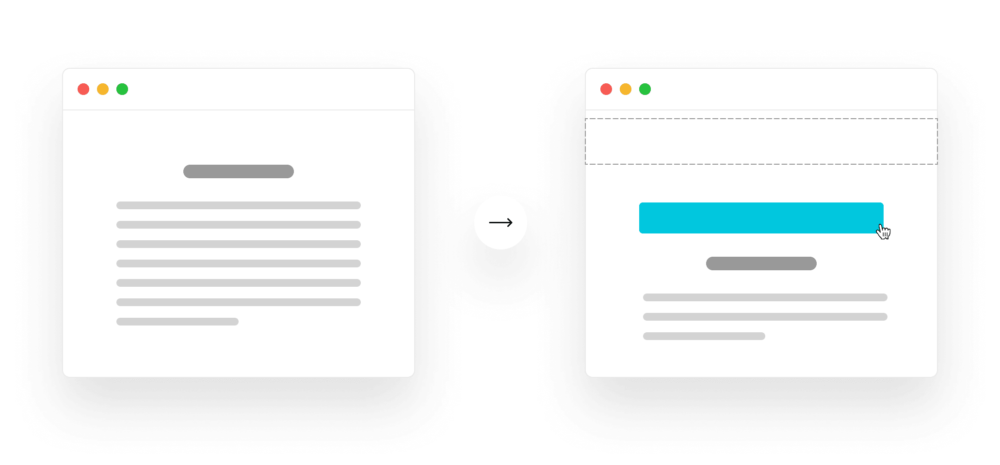

# Cumulative Layout Shift (CLS)

20

Chapter 20

The Cumulative Layout Shift (CLS) metric is a measure of your site’s overall layout stability. A site that unexpectedly shifts layout as the
page loads can lead to accidental user error and distraction.

Cumulative Layout Shift (CLS) occurs when elements have been shifted after initially being rendered by the DOM. Here, a button was rendered to the screen

after the text block, causing the block to shift downward. A combination of impact and distance is considered when calculating CLS.

Each element’s individual layout shift score is only counted toward CLS if unexpected movement occurs. If a new element is added to the DOM or an
existing element changes size, it doesn’t count toward layout shift if the loaded elements maintain their position.

#### Further Reading

- Google: Cumulative Layout Shift Documentation
- Vercel: Blog: Core Web Vitals - Cumulative Layout Shift
