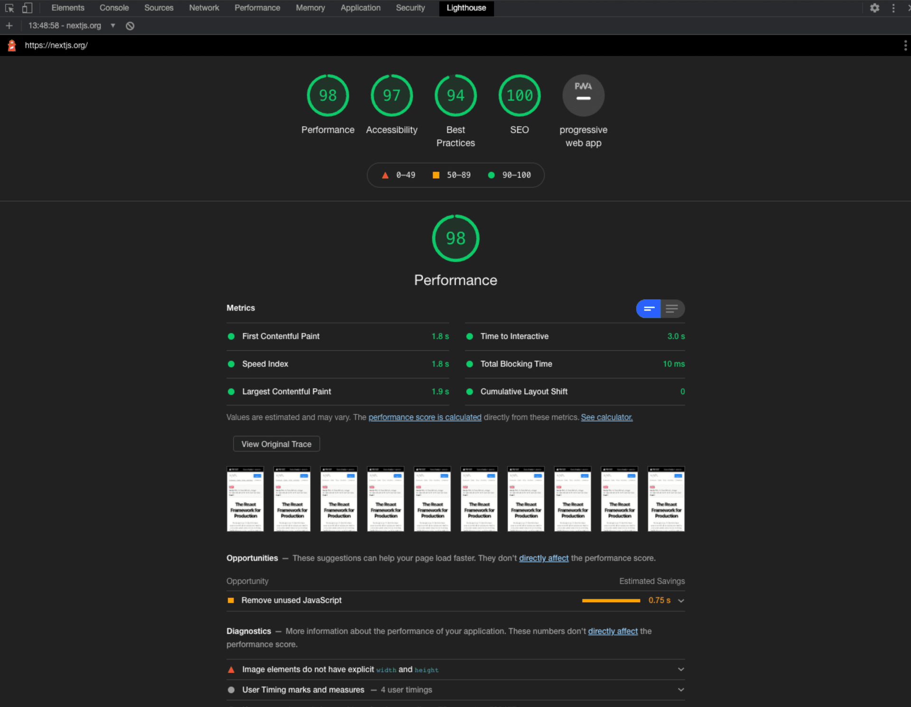

# Introducing Lighthouse


As we saw in the previous section, Core Web Vitals focus on aspects of the user experience via loading performance (Largest Contentful Paint), interactivity (First Input Delay), and visual stability (Cumulative Layout Shift).

In this lesson, we'll focus on how to measure Core Web Vitals through the use of a simulated environment called Lighthouse.

Note: For this lesson we will be using Chrome Dev Tools. However, there are many ways to run Lighthouse.

Lighthouse works by running a series of audits on a provided URL. Based on these audits, it generates a report on how well the page performed. If there



are areas that need improvement, the report will provide insight on how to improve.

Let's take a look at two examples of a Lighthouse report to see the difference between a site that has healthy Core Web Vitals and one that does not.

#### Optimized Example

To see an example of how Lighthouse works, we will use our homepage.

- Open Chrome.
- In an incognito window, navigate to https://nextjs.org.
- Open DevTools and click on Lighthouse tab.
- Click Generate Report.

This will now run a report which should take less than 60 seconds.

Note: It is important to run reports in an incognito window, as third-party plugins will affect your report.

In addition, ad blockers can block scripts from loading, which would give an incomplete audit. Consider setting a clean persona to measure performance.

Here's an example report:

#### Unoptimized Example

For the purpose of this tutorial, we have created an application without any optimizations.

##### Project Setup

This is a basic unoptimized application that allows visitors to do two things: search for a country to retrieve its population and click on a button to read
a pop-up modal. This application is meant to mimic the reality of working on large applications where the use of third-party libraries cannot be avoided.

##### Download Starter Code

```bash
npx create-next-app@latest nextjs-lighthouse --use-npm --example "https://github.com/vercel/next-learn/tree/main/seo"
```

##### Run Production Build

To get accurate reports from Lighthouse, your application should always be tested with a production build. To run a production build, change into the
project directory:

```bash
cd nextjs-lighthouse
```

Build your application by running next build and start the server in
production mode by running next start.

```bash
npm run build && npm run start
```

Let's run a Lighthouse report with Chrome DevTools. Once the report has completed, let's start to optimize the site and improve the vitals.

#### Further Reading

- Google Chrome: Lighthouse Scoring Calculator
