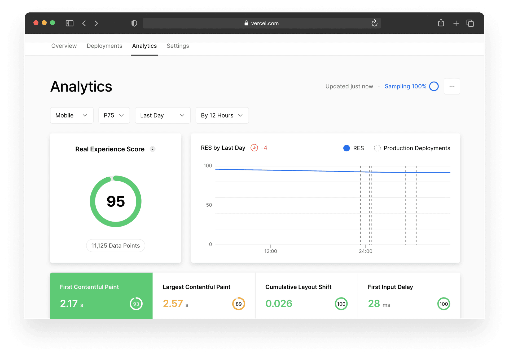

# Next.js Speed Insights

Next.js Speed Insights allows you to analyze and measure the performance of pages using Core Web Vitals.

You can start collecting your Real Experience Score with zero-configuration on Vercel deployments.
