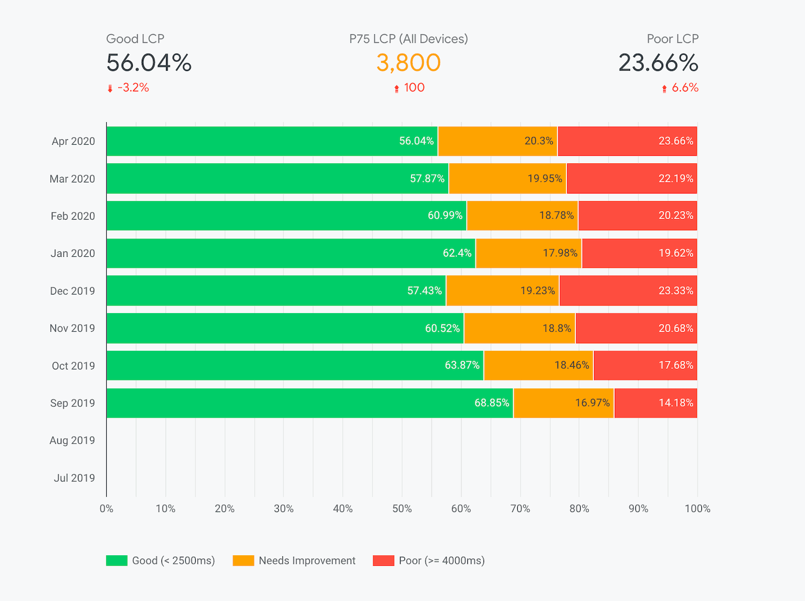

# Data Studio (Chrome User Experience Report)

33

Chapter 33

Another great free and open-source way of measuring your performance is to use the Chrome User Experience Report dataset.

The Chrome User Experience Report provides user experience metrics for how real-world Chrome users experience popular destinations on the web.

This dataset is publicly available under BigQuery and you can also consume it under Google Data Studio completely for free.

Luckily for you, there are open-source dashboards available that you can use as a template for tracking the performance of your website.

The only downside of this dataset is that, in order for your website to be included in the CrUX report, it will need to have a meaningful amount of visits otherwise it won't be included in the report due to lack of data. Hence this it may not the best option for work-in-progress or recently created websites.

Also, the data is updated on a monthly basis. Usually around 15 days after the month is finished, so you will see the data with certain delay and that might not be the most practical thing if you plan to work on improving your Core Web Vitals scores.

#### Further Reading

- Google: Example Dashboard (copy for free)

### You've Completed Chapter 33

Next Up

34: Next Steps

Was this helpful?